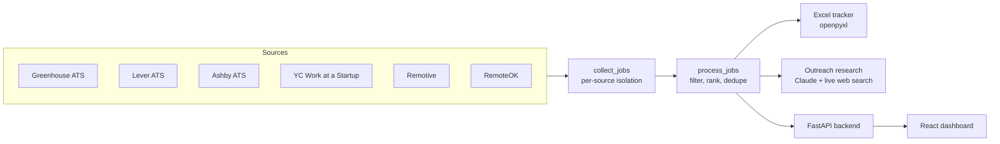

# EarlyBird

Job search automation that surfaces attainable engineering roles within hours of posting and cuts outreach prep to minutes.

New engineering roles get hundreds of applicants within a day of reaching the big job boards. EarlyBird attacks that from both ends: it polls company ATS APIs directly, so roles appear here before they hit aggregators, and it filters hard for attainability, so an early-career engineer sees only roles they can realistically get -- right level, right track, right geography, paid. For the top matches it then researches a real outreach contact at the company (live web search, never guessed) and drafts a short personalized message, turning "found a posting" into "ready to send" in one run.

Live demo: [earlybird-ashen.vercel.app](https://earlybird-ashen.vercel.app)

## Demo video

<!-- DEMO VIDEO: to add it, edit this README on github.com and drag your
     .mp4 or .mov file onto the line below. GitHub uploads it and inserts a
     user-attachments URL that renders as an embedded player. Keep the file
     under 10 MB (roughly 60 to 90 seconds of screen recording). -->

*Demo video coming soon.*

## What a run produces

**Web dashboard** (`earlybird-ui/`): enter an Anthropic API key, click Run Pipeline, and browse ranked job leads and researched outreach contacts in the browser.

**Excel tracker** (CLI): a color-coded workbook with three sheets:

- `Jobs` -- ranked roles with type, location, source, posting age, apply link, and application-status columns. Roles under 1 hour old are flagged; the rank score puts the most attainable, freshest roles on top.
- `Outreach` -- for the top-ranked roles, a researched contact (name, title, LinkedIn) and a tailored draft message.
- `Legend` -- what the colors and rank signals mean.

<!-- SCREENSHOTS: drop PNG files into docs/screenshots/ and update these paths.
     Suggested captures: the dashboard job list, the Excel Jobs sheet. -->

## Architecture



Three deployable parts share one pipeline:

1. **Pipeline** (`job_pipeline_full.py`): scraping, filtering, ranking, outreach research, Excel output. Runs standalone from the CLI.
2. **Backend** (`api.py`): FastAPI server that runs the pipeline in a background thread and serves results as JSON. Visitors supply their own API key per request; nothing is stored.
3. **Frontend** (`earlybird-ui/`): React + Vite + Tailwind dashboard, deployed on Vercel.

## Engineering decisions

**ATS JSON endpoints instead of scraping job boards.** LinkedIn and Indeed actively fight scrapers, break integrations without notice, and prohibit scraping in their terms. Greenhouse, Lever, and Ashby publish documented JSON APIs for their public boards; YC Work at a Startup embeds its listings as JSON and permits crawling in robots.txt. Building on stable, terms-respecting endpoints means the pipeline degrades predictably instead of silently rotting. JobSpy (LinkedIn/Indeed) exists behind a config flag but ships disabled.

**Filters fail open, and a real bug is the reason.** An early version classified roles as internships by substring, so "intern" matched "Internal Tools" and silently dropped legitimate full-time roles on every run for weeks. The fix (word-bounded regex) shaped a policy applied across the pipeline: token matching on short words is word-bounded, blank locations pass rather than drop, and postings that are ambiguous about pay or enrollment are kept with a "verify" note in the tracker instead of discarded. A filter that quietly over-drops is worse than one that under-drops, because its output looks plausible.

**Ranking optimizes for attainability, not just freshness.** A brand-new staff role at a unicorn is useless to an early-career candidate. The rank score rewards entry/mid title signals, smaller companies (using the company's ATS board size as a headcount proxy), stack keyword match, remote eligibility, and paid role types that convert fastest -- and penalizes seniority markers and degree requirements. Freshness matters but is deliberately weighted so it cannot outrank attainability.

**Layered filtering with a title-level track gate.** Roles pass through independent, individually tunable gates: profile relevance, on-track title (with an allow-list for startup titles like "Founding Engineer" and "Member of Technical Staff" that carry no standard keyword), seniority ceiling, off-target function and ops/infra exclusion, years-of-experience cap, and a geography gate that accepts US-eligible remote or listed metros only. Each gate lives in `config.py`, so retuning the search never means touching pipeline logic.

**Per-source isolation.** Every source is wrapped so a timeout, dead board slug, or schema change costs exactly that source's results for that run -- never the run. Failures print warnings with the source name; silent `except: pass` is banned in this codebase for the same reason the intern bug was dangerous.

**Contact research must cite the live web.** Outreach contacts come from Claude with the web search tool explicitly attached; without it the model would fall back to training data and invent plausible names. Fields that cannot be verified stay blank. A fabricated contact is worse than no contact.

**Bring-your-own-key security model.** The hosted demo takes each visitor's Anthropic key per request, uses it for that run only, and never logs or stores it. Results are keyed by unguessable high-entropy tokens, auto-expire after 30 minutes, and sit behind per-IP rate limiting and a concurrency cap. The frontend ships CSP, HSTS, and frame-denial headers.

## Tech stack

- **Pipeline/backend:** Python 3.10+, FastAPI, Uvicorn, Anthropic SDK (with the `web_search_20250305` tool), openpyxl, BeautifulSoup, requests
- **Frontend:** React 19, Vite, Tailwind CSS
- **Hosting:** Vercel (frontend), Render (backend)

## Setup

```bash
git clone <this repo> && cd earlybird
python -m venv .venv
.venv\Scripts\activate          # Windows
source .venv/bin/activate       # Mac/Linux
pip install -r requirements.txt
cp .env.example .env            # then fill in ANTHROPIC_API_KEY at minimum
```

## Run modes (CLI)

```bash
python job_pipeline_full.py                  # standard: scrape + rank + outreach research
python job_pipeline_full.py --fresh          # fast poll: short window, no API calls
python job_pipeline_full.py --scrape-only    # scrape + Excel only, no API key needed
python job_pipeline_full.py --hours 24       # custom lookback window
```

| Mode | Claude API calls | Use case |
| ---- | ---------------- | -------- |
| standard | yes (top `OUTREACH_TOP_N` roles) | daily run with outreach drafts |
| `--fresh` | no | frequent polling for brand-new postings |
| `--scrape-only` | no | testing filters, no funded key needed |

All modes scrape every source enabled in `config.SOURCES` and write the Excel tracker.

## Run the web UI locally

```bash
# Terminal 1: backend on :8000
uvicorn api:app --reload --port 8000

# Terminal 2: frontend on :5173
cd earlybird-ui && npm install && npm run dev
```

The frontend defaults to `http://localhost:8000` for the API; override with `VITE_API_URL` in `earlybird-ui/.env.local`.

## Configuration

Everything tunable lives in `config.py`; secrets and identity live in `.env` and are read via environment variables only.

- `SOURCES` -- toggle each job source
- `WATCHLIST` / `ASHBY_COMPANIES` -- target companies per ATS
- `PROFILE_KEYWORDS` -- relevance and ranking keywords in three weight tiers
- `TRACK_TITLE_KEYWORDS` / `TRACK_TITLE_ALLOW` -- the title-level track gate and its startup-title allow-list
- `SENIORITY_EXCLUDE`, `FUNCTION_EXCLUDE`, `OPS_INFRA_EXCLUDE`, `MAX_YEARS` -- exclusion gates
- `ACCEPT_REMOTE` / `ACCEPTED_METROS` -- geography gate
- `INCLUDE_INTERNSHIPS`, `DEGREE_REQUIREMENT_MODE` -- role-type policy
- `LARGE_BOARD_THRESHOLD` / `SMALL_BOARD_THRESHOLD` -- company-size ranking proxy
- `DEFAULT_HOURS`, `FRESH_HOURS`, `OUTREACH_TOP_N` -- run tuning

## API

| Method | Path | Purpose |
| ------ | ---- | ------- |
| GET | `/health` | Liveness check |
| POST | `/run-pipeline` | Start a run; returns an unguessable `run_id` |
| GET | `/status/{run_id}` | Run status: queued, running, complete, error |
| GET | `/results/{run_id}` | Full results once complete |
| POST | `/settings` | Validate session preferences; nothing persisted |

## Deployment

- **Backend (Render):** defined in `render.yaml`; `autoDeploy` is off, so deploys are manual from the dashboard. Free tier sleeps when idle; first request after sleep takes about 30 seconds.
- **Frontend (Vercel):** project root is `earlybird-ui`, `VITE_API_URL` points at the Render URL, security headers ship via `earlybird-ui/vercel.json`.

## Scheduling

Poll frequently with `--fresh` (no API key needed) and run standard mode once daily:

```bash
# cron: fast poll every 2 hours, full run each morning
0 */2 * * * cd /path/to/earlybird && python job_pipeline_full.py --fresh >> logs/pipeline_log.txt 2>&1
0 8 * * *   cd /path/to/earlybird && python job_pipeline_full.py >> logs/pipeline_log.txt 2>&1
```

On Windows, the equivalent is a Task Scheduler job running the same commands.

## Limitations and future work

Honest accounting of where this stands:

- **Volume depends on watchlist quality.** ATS polling only sees companies on the list. The watchlist skews to AI startups by design; a different candidate would retune it in `config.py`.
- **Aggregator boards are thin for software roles.** Remotive carries few software-dev listings inside a one-week window, and RemoteOK's public API feed is not dev-filtered. Both are kept because they are nearly free to poll, but ATS boards and YC carry the real supply.
- **Contract roles do not live on ATS boards.** Staffing platforms (Toptal, Upwork, Braintrust) gate listings behind login and anti-bot measures, so contract discovery stays manual by choice.
- **YC listings carry no per-job timestamps**, so they are treated as 48 hours old and never flag as fresh.
- **No automated test suite.** Filter logic has been validated with scripted assertion checks (the intern/internal regression among them), but those scripts are not yet committed as a proper test suite.
- Planned: resume-to-job matching via embeddings, a morning digest, and wider Ashby coverage.

## License

MIT
